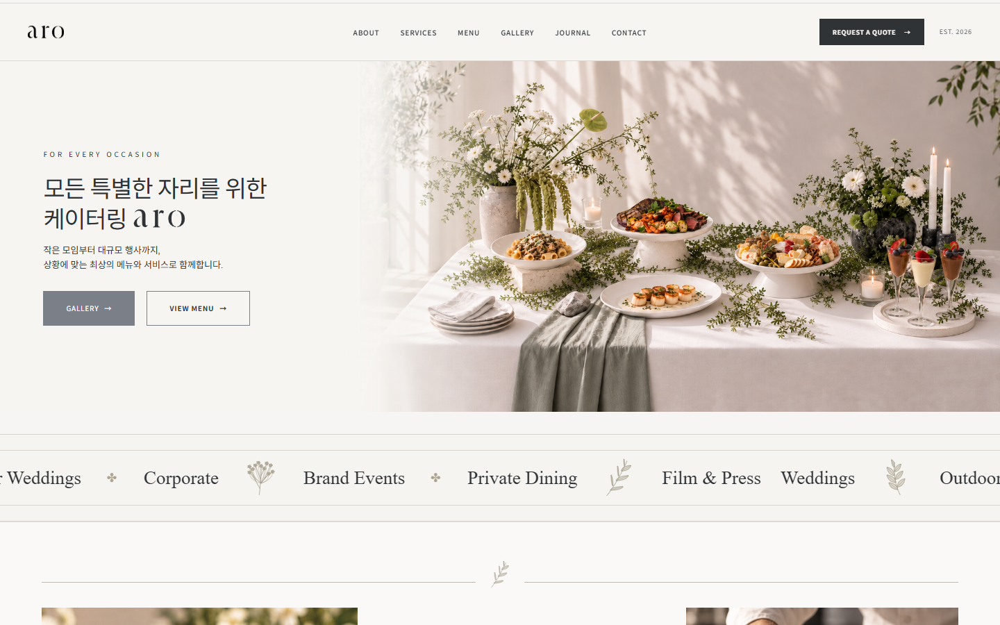
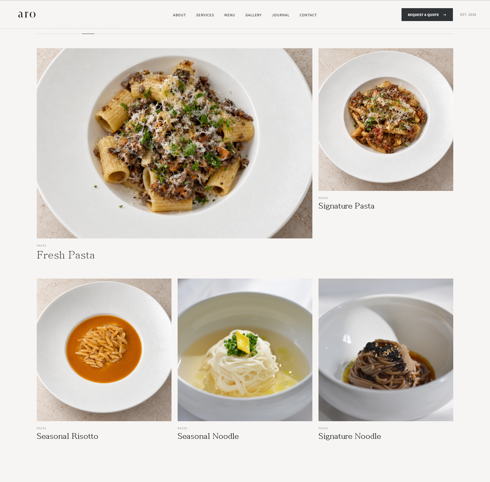

# ARO Catering & Events

**브랜드 소개부터 메뉴 탐색과 견적 문의까지 연결하는 케이터링 웹사이트**

‘아로새기다’에서 시작한 브랜드 ARO의 철학을 음식과 공간 이미지로 표현했습니다. React로 페이지를 구성하고 메뉴 필터, 행사 갤러리와 모바일 내비게이션을 구현했습니다.

🔗 [사이트 주소](https://hyeran712.github.io/aro1/)

📎 [프로젝트 포트폴리오 PPT · 12장 요약본](output/ARO_website_portfolio_summary.pptx)



---

## 💡 프로젝트 목표

고객이 **서비스 유형과 음식, 행사 분위기를 확인한 뒤 문의**할 수 있도록 기획했습니다.

- 브랜드 소개와 사진으로 ARO의 분위기 전달
- 메뉴와 갤러리를 카테고리별로 탐색
- FAQ와 진행 절차로 상담 전 궁금한 점 안내
- 견적 문의 화면으로 상담 진입 경로 제공

## 🎨 디자인 방향

[Catered Framer 템플릿](https://catered-template.framer.website/)의 이미지 중심 구성과 여백을 참고해 한국어 콘텐츠와 여러 페이지로 재구성했습니다.

- **컬러:** 아이보리 배경, 실버 강조, 차콜 텍스트
- **타이포그래피:** Cormorant Garamond, Noto Serif KR
- **이미지:** 메뉴 사진으로 요리를, 테이블 사진으로 행사 분위기를 표현

## 🧭 서비스 구조

**브랜드 확인 → 서비스 탐색 → 메뉴·갤러리 확인 → FAQ·절차 확인 → 견적 문의**

- `HOME` — 브랜드 메시지, 철학, 서비스, FAQ, 문의 폼
- `ABOUT` — 브랜드 미션과 다섯 가지 태도
- `SERVICES` — 행사 유형별 케이터링 소개
- `MENU` — 메뉴 카테고리와 재료 설명
- `GALLERY` — 행사 유형별 이미지 탐색
- `JOURNAL` — 브랜드 이야기와 소식
- `PROCESS` — 상담부터 진행까지의 절차
- `CONTACT` — 연락처, 지도 링크, 문의 폼

## ✨ 주요 기능

- React Router를 활용한 8개 페이지 연결
- 공통 Header와 Footer 컴포넌트
- 13개 메뉴 항목의 카테고리 필터
- 14개 갤러리 항목의 행사 유형 필터
- 마우스와 키보드 초점으로 메뉴 재료 설명 표시
- FAQ 접기·펼치기
- 모바일 메뉴 열기·닫기와 Escape 키 처리
- 문의 입력 상태 관리와 네이버 지도 연결

메뉴와 갤러리 수치는 화면의 콘텐츠 항목 수이며 실제 판매 상품 수나 행사 실적을 의미하지 않습니다.

## ⚙️ 핵심 구현 코드

### 1. 메뉴 필터

카테고리 선택에 따라 표시할 메뉴를 변경합니다.

```jsx
const [activeCategory, setActiveCategory] = useState("ALL");

const filteredItems =
  activeCategory === "ALL"
    ? menuItems
    : menuItems.filter((item) => item.category === activeCategory);
```

📄 [src/pages/Menu.jsx](src/pages/Menu.jsx)



### 2. 모바일 메뉴

메뉴의 열림 상태를 관리하고 버튼과 내비게이션을 연결합니다.

```jsx
const [menuOpen, setMenuOpen] = useState(false);

<button
  type="button"
  aria-label={menuOpen ? "메뉴 닫기" : "메뉴 열기"}
  aria-expanded={menuOpen}
  aria-controls="mobile-navigation"
  onClick={() => setMenuOpen((open) => !open)}
>
  <span></span>
  <span></span>
  <span></span>
</button>
```

📄 [src/components/Header.jsx](src/components/Header.jsx)

### 3. 문의 폼

입력 상태를 관리하고 제출 시 안내를 표시합니다. 현재는 시안 동작으로 실제 전송 연동이 필요합니다.

```jsx
const handleChange = (e) => {
  setForm({ ...form, [e.target.name]: e.target.value });
};

const handleSubmit = (e) => {
  e.preventDefault();
  console.log("문의 제출:", form);
  setSubmitted(true);
};
```

📄 [src/pages/Contact.jsx](src/pages/Contact.jsx)

## 🛠 Tech Stack

- **Frontend:** React 19, JavaScript, HTML, CSS
- **Routing:** React Router DOM 7
- **Build:** Create React App / react-scripts
- **Deployment:** GitHub Pages, gh-pages

## 🔎 구현 과정에서 고려한 점

- 음식과 공간 사진을 중심으로 브랜드 분위기 전달
- 필터로 관심 있는 메뉴와 행사 유형만 탐색
- 질문은 필요한 순간에 펼쳐 읽도록 구성
- 모바일에서도 페이지 탐색과 문의 진입 제공

## ⚠️ 현재 한계

- 문의 폼의 서버 저장과 이메일 전송 미연동
- 방문자 수와 문의 전환율 측정 자료 없음
- 운영 전 연락처, 메뉴 조건과 이미지 사용 권한 확인 필요
- 서비스의 운영 중·확장 예정 표현 정리 필요
- Journal 상세 게시물 페이지 미구현

## 🚀 향후 개선

- 문의 입력 검증과 실제 접수 기능 연동
- 메뉴와 갤러리 콘텐츠 관리 기능 추가
- 메뉴 탐색과 문의 성공 이벤트 측정
- 모바일 사용성과 키보드 접근성 점검
- 상세 게시물과 서비스 안내 확장

## ▶️ 로컬 실행

```bash
npm install
npm start
```

현재 라우터 설정에 맞춰 [http://localhost:3000/aro1/](http://localhost:3000/aro1/)에서 확인합니다.

```bash
npm run build
```

## 📎 Portfolio

[ARO 웹사이트 제작 포트폴리오 PPT 다운로드](output/ARO_website_portfolio_summary.pptx)

기획 목표, 디자인 방향, 페이지 구성, 주요 코드와 개선 과제를 12장으로 정리했습니다.
